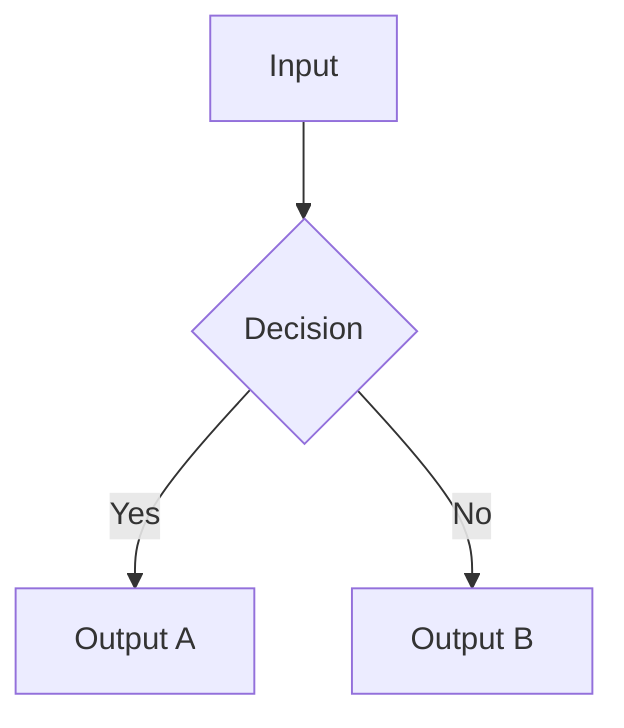

# Generate Chapter Text — Detailed Instructions

This skill provides the detailed writing instructions for each of the 15 sections in a
chapter document, plus the complete handoff JSON template.

---

## PERSONALIZATION PROTOCOL — DO THIS BEFORE WRITING ANY SECTION

**The chapter doc is the primary learning artifact. If its examples do not feel like the
student's daily reality, everything built on top of it (exercises, quiz, slides, podcast)
will also fail. Personalize relentlessly.**

### Before writing § 1, extract and pin this context:

```
From personalization_plan.json:
  protagonist       = running_example_per_chapter[chapter_slug].protagonist
  protagonist_role  = running_example_per_chapter[chapter_slug].protagonist_role
  domain_context    = running_example_per_chapter[chapter_slug].domain_context
  scenario_id       = scenario_assignments[chapter_slug]
  vocab             = vocabulary_substitutions  ← pin this dict; use it everywhere

From students.yaml:
  fk_target         = reading_level_target
  prior_knowledge   = prior_knowledge[]
  professional_ctx  = professional_context

From personalization_plan.reading_register:
  tone              = tone
  sentence_max      = avg_sentence_words_max
```

### Personalization rules that apply to every section:

1. **Open every section with the protagonist in action** — not with a definition or principle.
   - BAD:  "Context injection is a technique for providing dynamic information to a language model."
   - GOOD: "When Sara prepares the daily escalation report, she feeds the current queue snapshot
            directly into the prompt — that's context injection in practice."

2. **Name the system, name the object, name the role** — never use generic substitutes.
   - BAD:  "The system returns an error when the input is invalid."
   - GOOD: "Guidewire ClaimCenter returns a `VALIDATION_FAILED` response when the policy ID field is blank."

3. **Worked examples use the chapter's assigned scenario exclusively** — no invented examples.
   The scenario entities (`scenario.entities[]`, `scenario.artifacts[]`) are the raw material.

4. **Retrieval checkpoints frame recall in the protagonist's context:**
   - BAD:  "What happens when you pass an empty payload?"
   - GOOD: "Before Sara runs the nightly batch — what does the system do if the shipment ID is missing?"

5. **Reflection prompts anchor to the student's professional situation:**
   - BAD:  "How would you apply this in a real project?"
   - GOOD: "Think about your team's current claim intake process. Which of the three failure modes
            from this chapter is most likely to show up first, and why?"

6. **Reading level check per section** — after drafting each section, verify:
   - Avg sentence length ≤ `sentence_max` words
   - Technical terms introduced for the first time include an inline definition
     (unless in `prior_knowledge[]` — those get zero explanation)
   - Tone matches `professional_ctx` register

### Generic-to-domain substitution checklist (run before submitting):

| If you wrote → | Replace with → |
|----------------|---------------|
| "a user" | `protagonist` + `protagonist_role` |
| "the system" | domain system name from `vocab.system` |
| "an item" / "the item" | `vocab.item` |
| "the process" | `vocab.process` |
| "consider a scenario" | "In {domain_context}…" |
| "imagine you are" | "As {protagonist_role}, you…" |
| "returns an error" | returns the domain-specific error from scenario or pitfalls |

---

## Prose Guidelines (all sections)

- **Active voice**: "The filter removes noise" not "Noise is removed by the filter"
- **Second person**: "You configure the pipeline" not "The learner configures the pipeline"
- **Imperatives in steps**: "Open the settings panel" not "The settings panel should be opened"
- **No hedging**: "You can" and "you will" not "you might" or "learners may wish to"
- **Concrete before abstract**: always start with a real domain example, then extract the principle —
  NEVER lead with an abstract definition
- **FK grade calibration**: enforce `reading_register.avg_sentence_words_max` per sentence.
  After drafting each section, count: if avg sentence length exceeds the target, split sentences
  and replace multi-syllable words with their everyday equivalents
- **Domain vocabulary first**: use `vocabulary_substitutions` throughout. Never fall back to
  generic terms when the domain equivalent is available
- **Prior knowledge respected**: if a concept is in `prior_knowledge_map.assumed[]`, reference
  it without explanation. If it's in `needs_scaffolding[]`, introduce it from scratch using the
  Concrete-Pictorial-Abstract sequence with a domain analogy from `domain_analogies[]`
- **Protagonist-first sentences**: open the first sentence of each major section with the
  protagonist performing an action, not with a concept name or abstract statement

---

## Retrieval Checkpoint Format

Retrieval checkpoints go inside sections (§3, §5, §6, §7, §10). Format:

```markdown
> **Retrieval Check:** Before reading the answer below, try to recall:
> *{specific question requiring exact recall or application}*
>
> *(LO-ref: LO-NN.n)*

---

{Answer or next paragraph continues here}
```

Rules:
- The question must require genuine recall or application — not "what is X?" for something
  just introduced in the same paragraph
- Tie every checkpoint to a specific LO-ID
- Include at least 1 checkpoint per 3 sections (§7.5 master)
- Checkpoints in §10 are the main retrieval battery — list 3–5 there without inline answers

---

## Worked Example Narration Pattern (§5)

The worked example is the chapter's most important learning tool. It MUST use the chapter's
assigned scenario — not a generic or invented one. Extract every entity, artifact, and
constraint from `worked_example_seed` in the handoff JSON, which is derived from the scenario.

Use this structure:

```markdown
### Problem Statement
{One paragraph grounded in the protagonist's actual work situation.}
{Example: "Sara needs to process 47 shipment exceptions before the receiving dock closes at 17:00.
 Each exception requires a root-cause classification before it can be cleared in SAP WMS.
 Doing this manually takes 4 minutes per record — she needs an automated triage approach."}

### Given State
{What the protagonist starts with — use real domain values, not "sample data" or "example input".}

| {Domain entity} | {Domain-specific value} |
|----------------|------------------------|
| {e.g. Shipment ID} | {e.g. SHP-2024-00847} |
| {e.g. Exception type} | {e.g. OVER_RECEIVE} |
| {e.g. Dock close time} | {e.g. 17:00 local} |

### Step-by-Step Solution

**Step 1: {imperative verb} + {domain object}**
*Why this step:* {decision rationale tied to the scenario's constraints, not generic reasoning}
```{language}
# Variable names use domain vocabulary, not generic names like "data" or "result"
{e.g. shipment_exceptions = load_exceptions(dock_id="DOCK-7", status="UNCLEARED")}
```
**Expected output in {domain system}:**
```
{what the protagonist sees in their actual system, e.g. a SAP WMS confirmation screen}
```

**Step 2: ...**

### Decision Points

> **Decision:** At Step {N}, {protagonist} considered {domain-grounded alternative}.
> We chose {our approach} because {reason tied to scenario constraints, not generic tradeoffs}.
> *In a different scenario — e.g. when {condition} — {alternative} would be the right call.*

### Final State
{What has changed in the protagonist's domain system. Name the system and the outcome.}
{Example: "SAP WMS now shows 47 exceptions as CLEARED, and the dock supervisor's dashboard
 updates automatically. Sara's receiving report exports in 8 seconds instead of 3 minutes."}
```

---

## Diagram Generation Instructions

For every diagram in the chapter doc:

1. Author the diagram in a fenced ` ```mermaid ` block in the doc:


2. Name and save the `.mmd` source file:
   `outputs/{course_slug}/chapters/ch{NN}-{slug}/diagrams/{diagram_name}.mmd`

3. Export to SVG using Bash:
   `npx mmdc -i {mmd_path} -o {svg_path}`

4. In the doc, reference the SVG:
   ``

5. Write the `alt_text` into the handoff JSON `diagrams[]` array (describes shapes AND relationships)

---

## Handoff JSON Template

Write this file after completing the chapter doc. Every field is required.

```json
{
  "chapter": {
    "number": <int>,
    "slug": "<string>",
    "title": "<string>",
    "est_minutes": <int>
  },
  "learning_outcome_refs": ["LO-NN.1", "LO-NN.2"],
  "section_outline": [
    { "id": "1", "heading": "Chapter Overview", "bloom_tag": "Remember", "est_minutes": 5 },
    { "id": "2", "heading": "Building on Chapter N", "bloom_tag": "Remember", "est_minutes": 5 },
    { "id": "3", "heading": "Core Concept Introduction", "bloom_tag": "Understand", "est_minutes": 10 },
    { "id": "4", "heading": "Mental Model", "bloom_tag": "Understand", "est_minutes": 8 },
    { "id": "5", "heading": "Worked Example", "bloom_tag": "Apply", "est_minutes": 12 },
    { "id": "6", "heading": "Step-by-Step Walkthrough", "bloom_tag": "Apply", "est_minutes": 8 },
    { "id": "7", "heading": "Variations", "bloom_tag": "Apply", "est_minutes": 8 },
    { "id": "8", "heading": "Common Pitfalls", "bloom_tag": "Analyze", "est_minutes": 8 },
    { "id": "9", "heading": "Connections to Other Chapters", "bloom_tag": "Analyze", "est_minutes": 5 },
    { "id": "10", "heading": "Retrieval Checkpoints", "bloom_tag": "Remember", "est_minutes": 5 },
    { "id": "11", "heading": "Practice Problems", "bloom_tag": "Apply", "est_minutes": 5 },
    { "id": "12", "heading": "Reflection Prompts", "bloom_tag": "Evaluate", "est_minutes": 5 },
    { "id": "13", "heading": "Further Reading", "bloom_tag": "Understand", "est_minutes": 3 },
    { "id": "14", "heading": "Glossary", "bloom_tag": "Remember", "est_minutes": 3 },
    { "id": "15", "heading": "Chapter Summary", "bloom_tag": "Understand", "est_minutes": 5 }
  ],
  "running_example": {
    "scenario_ref": "<scenario_id from personalization_plan>",
    "entities": ["<entity name>"],
    "artifacts": ["<artifact name>"]
  },
  "worked_example_seed": {
    "problem_statement": "<string>",
    "given_state": "<string>",
    "solution_steps": [
      { "step": 1, "action": "<string>", "rationale": "<string>", "code": "<optional string>" }
    ],
    "final_state": "<string>",
    "decision_points": [
      { "at_step": 2, "alternatives_considered": "<string>", "decision": "<string>", "reason": "<string>" }
    ]
  },
  "glossary_delta": [
    { "term": "<string>", "definition": "<string>", "locale_translations": {} }
  ],
  "chapter_pitfalls": [
    { "misconception": "<string>", "why_wrong": "<string>", "correction": "<string>" }
  ],
  "retrieval_checkpoints": [
    { "section_id": "3", "prompt": "<string>", "target_lo_ref": "LO-NN.1" }
  ],
  "reflection_prompts": [
    { "prompt": "<string requiring synthesis of ≥ 2 concepts>" }
  ],
  "diagrams": [
    {
      "name": "<descriptive name>",
      "source_path": "chapters/ch{NN}-{slug}/diagrams/{name}.mmd",
      "svg_path": "chapters/ch{NN}-{slug}/diagrams/{name}.svg",
      "alt_text": "<describes shapes and relationships, not just content>",
      "type": "flowchart | C4 | sequence | ER"
    }
  ],
  "quiz_seed": {
    "candidate_misconceptions": ["<from chapter_pitfalls>"],
    "candidate_scenarios": ["<scenario_ids appropriate for quiz stems>"]
  },
  "reading_metrics": {
    "word_count": <int>,
    "flesch_kincaid_grade": <float>
  }
}
```

---

## Section Word-Count Targets

| Section | Min | Max |
|---------|-----|-----|
| § 1 Overview | 150 | 250 |
| § 2 Building on (skip ch01) | 100 | 200 |
| § 3 Core Concept | 400 | 700 |
| § 4 Mental Model | 300 | 500 |
| § 5 Worked Example | 500 | 900 |
| § 6 Walkthrough | 400 | 700 |
| § 7 Variations | 300 | 500 |
| § 8 Common Pitfalls | 300 | 500 |
| § 9 Connections | 150 | 250 |
| § 10 Retrieval | 100 | 200 |
| § 11 Practice | 150 | 300 |
| § 12 Reflection | 100 | 200 |
| § 13 Further Reading | 100 | 200 |
| § 14 Glossary | 100 | 300 |
| § 15 Summary | 200 | 350 |
| **Total** | **3,350** | **6,050** |

Target: 3,500–6,000 words (FK grade check after writing).
