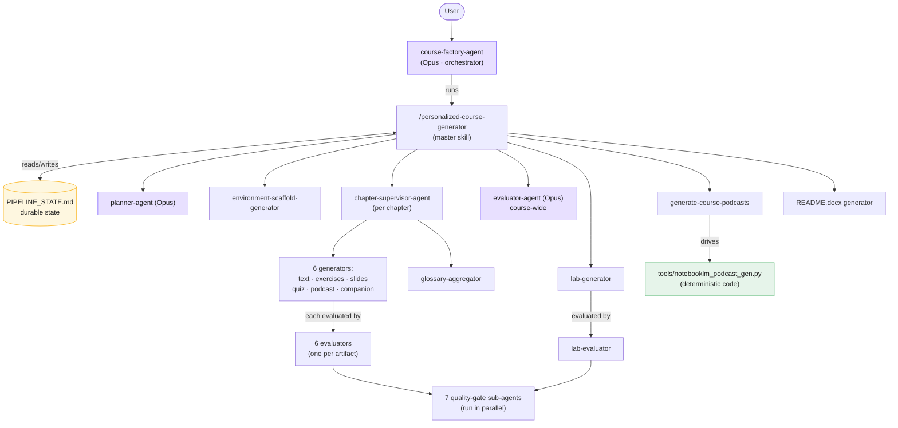
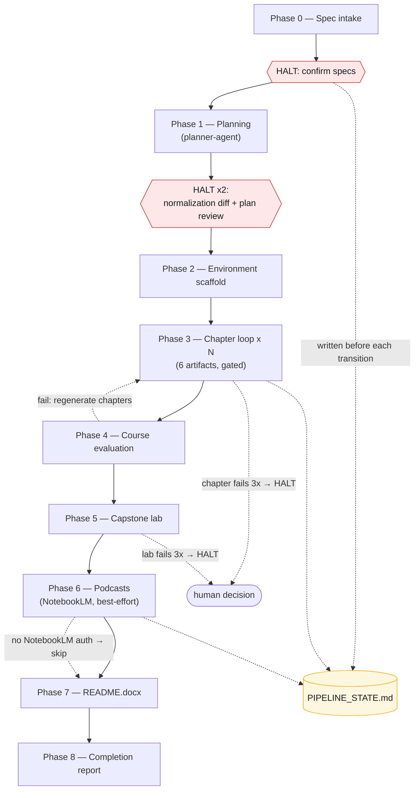
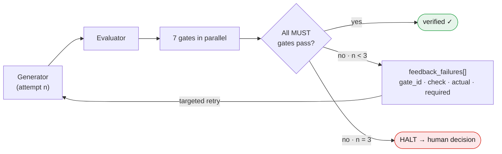
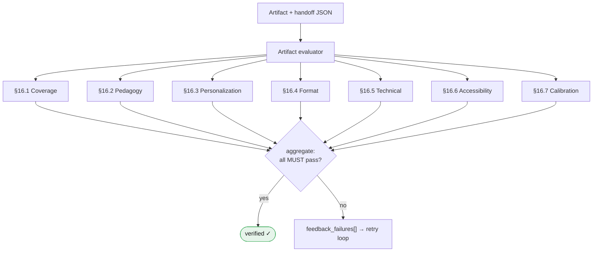
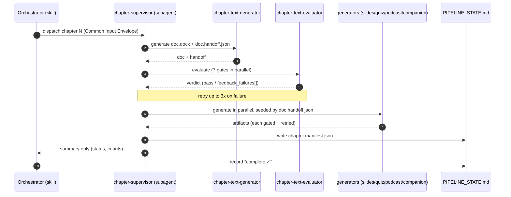

# Architecture — Personalized Course Factory

This document explains *how* and *why* the course factory is built the way it is: the layering,
the flow, the validation and quality model, the pedagogy and personalization it enforces, and
the engineering choices that make a long multi-agent pipeline run **reliably and efficiently on
top of Claude Code**. For *how to use* the system, see [`README.md`](README.md). For the binding
rules and schemas, see [`CLAUDE.md`](CLAUDE.md) and the specs under [`doc/`](doc/).

---

## 1. What problem the architecture solves

Generating a complete course is not one task — it is dozens of interdependent tasks
(plan → environment → N chapters × 6 artifacts → cross-course evaluation → capstone → podcasts →
onboarding guide), each of which must be **correct, pedagogically sound, personalized, and
consistent with every other artifact**. Three forces shape every design decision:

1. **Quality is non-negotiable and must be measured, not assumed.** Generic or
   happy-path-only content is a defect. Every artifact is independently judged against explicit
   gates before it ships.
2. **Context is finite.** A course can be 18 chapters. Reading every spec and every prior
   artifact into one conversation would exhaust the model's context long before the course is
   done. The architecture is built to keep the *orchestrator's* working set small while still
   producing large, deeply-grounded artifacts.
3. **Long runs get interrupted.** Sessions compact, machines sleep, quotas pause. The pipeline
   must be **resumable** from durable state, not from conversation memory.

The architecture is a direct response to these three forces: **separate judgment from
generation, isolate heavy work in subagents, and persist state to disk.**

---

## 2. The layered model

```
┌───────────────────────────────────────────────────────────────────────────┐
│  INPUTS / SPECIFICATIONS  (the contracts — prose + YAML/JSON, versioned)    │
│  inputs/{subject.md, problem.yaml, students.yaml, general-requirements.yaml}│
│  doc/{GreatCourseSpec, PlannerSpec, GreatTextSpec, …}  ·  CLAUDE.md          │
└───────────────────────────────────────────────────────────────────────────┘
                │ read by
                ▼
┌───────────────────────────────────────────────────────────────────────────┐
│  ORCHESTRATION  (state machine + human-review halts)                        │
│  course-factory-agent  ──runs──▶  /personalized-course-generator (skill)    │
│  durable state: outputs/{slug}/_plan/PIPELINE_STATE.md                      │
└───────────────────────────────────────────────────────────────────────────┘
                │ dispatches (as subagents)
                ▼
┌───────────────────────────────────────────────────────────────────────────┐
│  PLANNING            planner-agent → course-plan.yaml,                      │
│                      personalization-plan.json, reserved-scenarios.json     │
├───────────────────────────────────────────────────────────────────────────┤
│  GENERATION (per chapter, via chapter-supervisor-agent)                     │
│    text · exercises · slides · quiz · podcast-script · companion            │
├───────────────────────────────────────────────────────────────────────────┤
│  EVALUATION (one independent evaluator per artifact)                        │
│    each evaluator fans out to 7 quality-gate sub-agents IN PARALLEL         │
├───────────────────────────────────────────────────────────────────────────┤
│  COURSE-LEVEL   evaluator-agent · lab-generator · generate-course-podcasts  │
│                 · glossary-aggregator · README.docx                          │
└───────────────────────────────────────────────────────────────────────────┘
                │ deterministic glue where the work is mechanical
                ▼
┌───────────────────────────────────────────────────────────────────────────┐
│  TOOLS (code)   tools/notebooklm_podcast_gen.py  ·  anthropic-skills:{docx, │
│                 pptx}  ·  npx mmdc (Mermaid)  ·  preflight scripts            │
└───────────────────────────────────────────────────────────────────────────┘
```

The crucial property: **each layer below the orchestrator runs as an isolated subagent.** Its
context (specs, prior artifacts, retries) is born when it is invoked and reclaimed when it
returns. The orchestrator only ever holds summaries.

### 2.1 Agent & skill hierarchy

The cast of agents and how they relate. The orchestrator runs a single skill, which dispatches
every other agent as an isolated subagent; the chapter supervisor in turn dispatches the six
generators and their evaluators; each evaluator fans out to seven gate sub-agents.



---

## 3. The flow

Driven by the `/personalized-course-generator` skill (invoked by `@course-factory-agent`).
Diamonds are human-review halts; the dashed edges are the failure / skip branches.



The per-phase table:

| Phase | What runs | Output | Gate / halt |
|------|-----------|--------|-------------|
| 0 — Spec intake | parse inline specs or read pre-filled files; validate | `inputs/*` complete | **HALT:** spec summary confirmation |
| 1 — Planning | `planner-agent` (12-step algorithm) | `course-plan.yaml`, `personalization-plan.json`, `reserved-scenarios.json` | **HALT ×2:** normalization diff (Step 2) + plan review (Step 12) |
| 2 — Environment | `environment-scaffold-generator` | devcontainer, preflight, lab-environment manifest | — |
| 3 — Chapters (loop) | `chapter-supervisor-agent` per chapter → 6 generators + 6 evaluators | `doc.docx`, `exercises/`, `slides.pptx`, quiz, `podcast-script.md`, companion | 7 gates per artifact; 3-attempt loop |
| 4 — Course evaluation | `evaluator-agent` | `COURSE_VERDICT.md` | cross-chapter coverage, running-example coherence, subject coverage |
| 5 — Capstone | `lab-generator` → `lab-evaluator` | `capstone/` | 7 gates + GreatLabSpec gates + problem fidelity |
| 6 — Podcasts | `generate-course-podcasts` → `tools/notebooklm_podcast_gen.py` | one NotebookLM Audio Overview per chapter | **best-effort, non-blocking** |
| 7 — README | docx generator | `README.docx` (student onboarding) | student-facing rules |
| 8 — Completion | orchestrator | completion report | — |

Every phase transition is written to `PIPELINE_STATE.md` **before** moving on. That file — not
the conversation — is the source of truth, which is what makes Phase 3 resumable mid-course.

---

## 4. Partitioning: why four kinds of artifact

The repository deliberately separates **specifications**, **skills**, **agents**, and **code**.
Each boundary exists for a concrete reason.

### 4.1 Specification vs. skill — *what to produce* vs. *how to produce it*

- **Specs (`doc/*.md`, `CLAUDE.md`)** are the durable **contract**: the 15-section chapter
  structure, the quiz rules, the lab gates, the file-naming convention, the Bloom verb tables,
  the docx design rules. They change rarely and are referenced by `§` number.
- **Skills (`.claude/skills/*.md`)** are the **procedures** that implement a spec: step-by-step
  instructions a generator follows. `generate-chapter-text` implements `GreatTextSpec`,
  `generate-quiz` implements `GreatQuizSpec`, and so on.

Why split them? A spec is a *normative reference* shared by a generator **and** its evaluator —
both sides cite the same `§` so generation and judgment cannot drift apart. A skill is an
*operational recipe* that can be tuned (better prompts, new ordering) without renegotiating the
contract. The spec is the test; the skill is the implementation.

### 4.2 Agent vs. skill — *who/when* vs. *the procedure*

- **Agents (`.claude/agents/*.md`)** define a **role**: a model assignment, a tool scope, and a
  short charter. Many agent files are intentionally *thin*. `course-factory-agent` essentially
  says "run the `/personalized-course-generator` skill"; the generators say "follow your skill."
- **Skills** hold the **detailed instructions** and are invocable directly by a human as slash
  commands (`/next-chapter`, `/course-status`, `/plan-course`).

Why split them? It keeps the **agent registry stable** (a fixed cast of roles with fixed model
tiers and permissions) while procedures evolve inside skills. It also lets the same procedure be
driven two ways — autonomously by the orchestrator, or one step at a time by a human typing the
slash command — without duplicating logic. The agent is the *actor*; the skill is the *script*.

### 4.3 Code vs. agent — *determinism* vs. *judgment*

This is the most important boundary. **Use an agent when the task needs judgment; use code when
the task is mechanical and must be exact.**

- Writing a personalized, FK-calibrated chapter that narrates a worked example → **judgment** →
  agent + skill.
- Driving a flaky external API (NotebookLM): find-or-create a notebook, upload three files per
  chapter with retry/backoff, scope each podcast to the right `source_id`s, rename only after
  generation completes, clean up partial uploads, stay idempotent across re-runs → **mechanical
  and exacting** → `tools/notebooklm_podcast_gen.py`.

The podcast tool is the canonical example of why this boundary pays off. The work is pure
plumbing with strict ordering and failure semantics; an LLM "doing it by hand" would be slow,
non-deterministic, and would burn context and quota on retries. Encoding it as code makes it
**fast, repeatable, and resumable** — and an agent (`generate-course-podcasts`) wraps it to
handle the judgment parts (auth state, what to report, when to skip). The same philosophy is why
document rendering is delegated to the `anthropic-skills:docx`/`pptx` skills and diagrams to
`npx mmdc`: deterministic rendering belongs in tools, not token streams.

---

## 5. Orchestration: reliable and efficient on Claude Code

The pipeline is engineered around Claude Code's execution model. Five techniques do the heavy
lifting.

### 5.1 Subagent context isolation (the core efficiency lever)

`@chapter-supervisor-agent` and every generator/evaluator/gate runs as a **subagent**. A
subagent gets its own context window; when it returns, only its *summary* (e.g.
`chapter.manifest.json`) flows back to the parent. Consequently the orchestrator's window grows
by a small constant per chapter, not by the size of the artifacts. This is what makes an
18-chapter course feasible: the expensive context (reading specs, drafting 6,000 words, three
retry attempts) lives and dies inside the subagent.

> Best practice applied: *delegate broad/heavy work to subagents and keep the conclusion, not the
> file dumps.* The orchestrator is a thin state machine, never a document store.

### 5.2 Parallelism where work is independent

- Each **evaluator fans out all 7 gate sub-agents in parallel** — coverage, pedagogy,
  personalization, format, technical, accessibility, calibration are independent checks, so they
  run at once and the evaluator aggregates the verdicts.
- Within a chapter, **independent generators run in parallel** (e.g. presentation + quiz +
  podcast), while dependent ones run after the chapter text (its `doc.handoff.json` seeds them).

This compresses wall-clock time without sacrificing the independence that makes the checks
trustworthy.

### 5.3 The feedback loop (bounded, structured retries)

Every generator/evaluator pair runs under one protocol:

```
attempt ≤ 3:
  generate(feedback_failures)          # empty on attempt 1
  verdict = evaluate()                 # 7 gates in parallel
  if all MUST gates pass → verified; stop
  else feedback_failures = failing gate details; retry
if 3 attempts fail → HALT, surface to human, record in chapter.manifest.json
```



Failures are returned as **structured `feedback_failures[]`** (`gate_id`, `check`, `actual`,
`required`), so a retry is a *targeted correction*, not a blind re-roll. Bounding at 3 attempts
prevents infinite loops and converts persistent failure into an explicit human decision.

### 5.4 Durable state + resumability

`PIPELINE_STATE.md` records phase status and per-chapter status and is written **before** each
transition. A chapter is a "checkpoint" only once that file is flushed. After any compaction or
new session, the orchestrator re-reads it and resumes from the first incomplete phase. Two usage
patterns build on this:

- **Loop-and-checkpoint:** `/next-chapter` generates exactly one chapter then halts at a clean
  boundary; `/loop /next-chapter` self-paces the whole course. `/course-status` reads only the
  state file (no artifact loading) for a cheap progress readout.
- **Resume protocol:** re-invoking `@course-factory-agent` detects saved state and offers to
  resume, restart specific chapters, or start fresh.

### 5.5 Human-in-the-loop at the expensive boundaries

Two **mandatory halts** sit inside planning: the normalization diff (how your specs map to the
course) and the full plan review (chapters, LOs, scenarios, time budgets). No content is
generated until both are approved. Halts are placed precisely where a wrong assumption would be
most expensive to discover later — *before* dozens of artifacts are generated. Later phases halt
only on failure (chapter fails 3×, evaluation fails, lab fails); the podcast phase never halts.

### 5.6 Right-sizing the model to the job

| Tier | Where | Why |
|------|-------|-----|
| Opus | `course-factory-agent`, `planner-agent`, `evaluator-agent` | multi-phase orchestration, curriculum design, cross-chapter reasoning |
| Sonnet | chapter supervisor, all generators, all evaluators, all gate sub-agents | well-specified generation and checklist evaluation driven by detailed skills/specs |

Reasoning-heavy roles get Opus; the many well-bounded generation/evaluation roles get Sonnet.
Detailed instructions live in the skills, so Sonnet agents stay reliable.

---

## 6. Validation & quality

### 6.1 The seven gates (§16)

Every artifact must pass all seven before it ships:

| Gate | Enforces |
|------|----------|
| §16.1 Coverage | every LO appears in ≥ 1 assessment; all required Bloom tiers present; no orphaned LO |
| §16.2 Pedagogy | retrieval checkpoints, worked examples, reflection prompts, ≥ 60 % hands-on, I-do/we-do/you-do, failure-first |
| §16.3 Personalization | every example traces to the personalization plan; running example consistent across artifacts; no capstone-reserved scenarios leaked |
| §16.4 Format | word/slide counts, section order, file naming (§5.2), front-matter completeness |
| §16.5 Technical | code compiles, `verify/` passes against `solution/`, preflight succeeds, no un-flagged deprecated APIs |
| §16.6 Accessibility | WCAG 2.2 AA: alt text, ≥ 4.5:1 contrast, no color-only information, font sizes, code-as-text |
| §16.7 Calibration | quiz difficulty heuristic 0.40–0.95, rubric schema, Flesch-Kincaid grade target, time-budget arithmetic |

Each evaluator runs all seven as independent, single-purpose sub-agents at once, then aggregates:



### 6.2 Three principles behind the gate design

- **Independent judgment.** The generator never grades itself. A separate evaluator (and seven
  separate single-purpose gate agents) judge the output, which removes the self-grading bias of
  "the same context that wrote it also approves it."
- **MUST gates are absolute.** Numeric *defaults* (item counts, word budgets) are tunable via
  `inputs/orchestration.yaml` and logged in `_plan/CHANGELOG.md`; the **MUST gates cannot be
  overridden by any input — not even General Requirements.** Quality floors are not negotiable.
- **Two scopes of validation.** Per-artifact gates catch local defects; the course-level
  `evaluator-agent` catches *emergent* ones — cross-chapter LO coverage, running-example
  coherence across all artifacts, glossary completeness, **subject-spec coverage** (every topic
  in `inputs/subject.md` is taught), and capstone eligibility.

---

## 7. Pedagogy — how best practices materialize

The course is grounded in evidence-based learning science, and the gates make that concrete
rather than aspirational:

- **Bloom's taxonomy** — every learning outcome is `verb + object + measurable criterion + Bloom
  level`; §16.1 checks all tiers are represented and assessed. Bloom labels and LO-IDs live only
  in *internal* artifacts (handoff JSON, speaker notes, instructor guides) and are **forbidden in
  student-facing text** (CLAUDE.md Rule 1).
- **Retrieval practice** (Roediger & Karpicke) — chapters embed retrieval checkpoints; quizzes
  ship as Form A + Form B with carry-forward items for spaced re-testing; §16.2 enforces presence.
- **Worked examples & faded guidance** (I-do / we-do / you-do, 4C/ID) — every exercise pack leads
  with a worked example *before* independent exercises; reversing that order is an explicit
  anti-pattern.
- **Failure-first** — happy-path-only content is banned; chapters carry pitfalls/misconceptions,
  exercises carry `failure-modes.md`. Debugging is taught, not hidden.
- **Cognitive load & Mayer's multimedia principles** — slide titles must be *conclusions* not
  topics; decorative graphics are forbidden; diagrams carry alt text. §16.6 enforces the
  accessibility side.
- **Calibrated difficulty & readability** — §16.7 checks the quiz difficulty heuristic and the
  Flesch-Kincaid grade against the cohort's `reading_level_target`.

Because these are encoded as gates, "good pedagogy" is something the pipeline *verifies on every
artifact*, not a hope.

---

## 8. Personalization — the first principle

Personalization is the **foundation**, not a finishing coat. Generic placeholder text ("a user",
"the system") is a defect. Every generator executes four steps before writing a word
(CLAUDE.md, "Personalization First Principle"):

- **P1 — Read the learner:** `reading_level_target`, `prior_knowledge[]` (build on, never
  re-teach), `professional_context` (the lens for every example), modalities, locale.
- **P2 — Read the plan:** `personalization-plan.json` supplies `vocabulary_substitutions`
  (every generic term → a domain term), the per-chapter scenario, and the per-chapter running
  example (protagonist + artifact).
- **P3 — Build a context block:** protagonist, domain system, domain object, scenario, the FK
  sentence-length budget, assumed vs. not-assumed prior knowledge, register.
- **P4 — Verify before submitting:** does every example name the protagonist and domain system?
  Does the FK grade match target? Any generic placeholder left? If so, revise.

Two invariants keep it coherent and protect the capstone:

- **Running-example coherence (§7.15):** the same protagonist/artifact instance appears across a
  chapter's doc, slides, exercises, quiz, and podcast. The personalization gate (§16.3) and the
  course-level evaluator both check this.
- **Reserved scenarios:** `reserved-scenarios.json` lists scenarios reserved exclusively for the
  capstone. Chapter generators receive them as `forbidden_examples` and must never use them — so
  the capstone is a genuine transfer task, not a rerun of chapter content.

The `personalization-plan.json` is produced once by the planner and is **read-only** downstream,
so every artifact personalizes against a single shared source of truth.

---

## 9. The contracts that glue it together

Two data contracts make loose coupling between subagents possible:

- **Common Input Envelope (§19.2)** — the chapter supervisor builds one envelope per generator:
  course slug, chapter metadata, learning outcomes, the full problem spec, student context, the
  personalization-plan path, output paths, the gate list to satisfy, `feedback_failures[]`, and
  `forbidden_examples[]`. Every generator receives the same shape, so the supervisor can dispatch
  any of them uniformly.
- **Handoff JSON (`doc.handoff.json`)** — produced by the chapter-text generator and passed to
  every downstream chapter generator. It carries the section outline (with Bloom tags), the
  running example, the worked-example seed, glossary deltas, pitfalls, retrieval checkpoints,
  reflection prompts, diagram references, the quiz seed, and reading metrics. This is how the
  slides, quiz, and podcast stay consistent with the chapter text **without** re-reading the full
  document — they read the handoff, not the prose. (It also feeds the course-level glossary via
  `glossary_delta`.)

These contracts are why a subagent can do its job from a small, well-specified input instead of
the whole course state — the same property that keeps context bounded.

---

## 10. Naming, formats, and the student/internal split

- **Role-based file naming (§5.2):** chapter artifacts are named by *role* (`doc.docx`,
  `slides.pptx`, `quiz-questions.docx`, …) inside `chapters/ch{NN}-{slug}/`, with no course or
  chapter prefix, which keeps every path within the Windows 260-character limit.
- **Office formats for students:** every student deliverable is `.docx` or `.pptx` (CLAUDE.md
  Rule 2); JSON/YAML/MD are internal pipeline files only.
- **Strict student/internal separation:** Bloom labels, LO-IDs, `§` numbers, chapter slugs,
  rubric IDs, and pipeline jargon are retained in internal artifacts but **never** appear in
  student-facing text. This is enforced by `DocxDesignSpec` and the format/accessibility gates.

---

## 11. Putting it together — one chapter, end to end

```
chapter-supervisor-agent (subagent — isolated context)
  1. build Common Input Envelope from course-plan + personalization-plan + students
  2. chapter-text-generator → doc.docx + doc.handoff.json
        └─ chapter-text-evaluator → [7 gates ∥] → pass? else feedback ↺ (≤3)
  3. in parallel, seeded by doc.handoff.json:
        presentation-generator → slides           quiz-generator → Form A/B
        podcast-generator → podcast-script.md
        companion-generator → cheatsheet + instructor guide
     each → its evaluator → [7 gates ∥] → feedback loop (≤3)
  4. glossary-aggregator merges handoff.glossary_delta into the course glossary
  5. write chapter.manifest.json  →  orchestrator records "complete ✓" in PIPELINE_STATE.md
```

As a sequence — note how the orchestrator delegates to the supervisor subagent and only receives
a summary back, keeping its own context small:



The orchestrator sees step 5's summary and moves on. All the heavy lifting in steps 1–4 stays in
the supervisor's isolated context and is reclaimed on return.

---

## 12. Design principles, summarized

1. **Separate judgment from generation** — independent evaluators + single-purpose gates remove
   self-grading bias.
2. **Isolate heavy work in subagents** — the orchestrator stays thin; large courses stay within
   context.
3. **Persist state to disk** — `PIPELINE_STATE.md` makes the whole pipeline resumable and
   compaction-safe.
4. **Bound the loops** — 3 attempts with structured feedback, then a human decision.
5. **Halt before expensive mistakes** — two planner halts gate all generation.
6. **Code for determinism, agents for judgment** — flaky/mechanical work (podcasts, rendering,
   diagrams) is code; everything needing taste is an agent + skill.
7. **Specs are contracts; skills are recipes; agents are roles** — change recipes freely, keep
   the contract and the cast stable.
8. **Personalize first, verify always** — personalization and pedagogy are gates, not hopes.
9. **Best-effort at the edges** — external-service steps (NotebookLM podcasts) never block
   delivery of the core course.

These principles are what let a large, multi-stage, LLM-driven pipeline behave like dependable
software: predictable outputs, measurable quality, graceful failure, and efficient use of both
context and compute.
