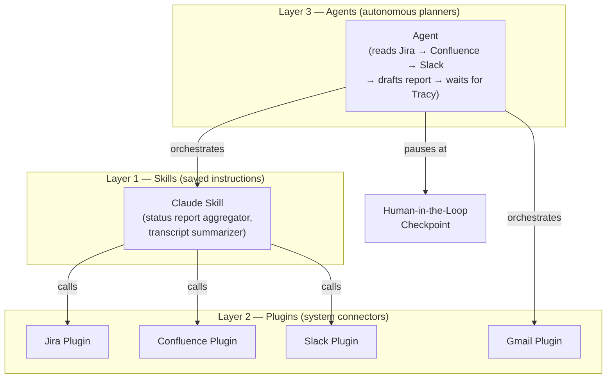

# Chapter 1: Introduction to Claude Cowork Automation

<!-- Bloom distribution: Remember × 2, Understand × 1 -->

---

## § 1 Chapter Overview [Remember]

Every Monday morning, Tracy opens her laptop and faces the same two-hour ritual: pulling up the Jira board to check what closed last week, scanning the Confluence project page for any updated documentation, scrolling back through the Slack project channel for decisions buried in threads, and hunting through Google Meet transcripts for the action items she assigned at Thursday's stand-up. By the time she has assembled enough information to start writing, a third of her morning is gone — and she has not yet written a single sentence of the executive status report that her stakeholders expect in their inbox by noon.

This chapter introduces Claude Cowork automation as the answer to that Monday morning ritual. You will learn what kinds of program management work Claude Cowork can and cannot automate, how the three foundational building blocks — **skills**, **plugins**, and **agents** — relate to each other at a conceptual level, and how to use the **RSTRM framework** to quickly evaluate any task in your workflow for automation potential.

By the end of this chapter, you will be able to:

- **LO-01.1 (Remember):** Identify what Claude Cowork can and cannot automate in a knowledge-work context — given a list of 8 workplace tasks, correctly classify at least 6 as automatable or not.
- **LO-01.2 (Understand):** Distinguish skills, plugins, and agents at a conceptual level — correctly map each of 3 tool types to a business use case with no more than 1 error.
- **LO-01.3 (Remember):** Recognize the 5-part RSTRM framework (Repetitive, Structured, Time-consuming, Rules-based, Multi-step) — recalling all 5 components from memory without reference.

This chapter is the conceptual foundation for the course. Every skill you build in Chapters 6 through 12 will apply the vocabulary and decision criteria introduced here.

---

## § 2 Prerequisites [Remember]

This is the first chapter of the course. There are no prerequisite chapters.

You are expected to be comfortable with: Jira boards and sprint tracking, Confluence project pages, Slack channel management, Google Meet and Drive, and the general rhythm of preparing weekly executive status reports. The chapter builds on these tools and workflows — it does not introduce them. If you want to verify your readiness for this material, the course's prerequisite diagnostic is available at `outputs/cowork-automation-tracy-2026/prereq-diagnostic.md`.

---

## § 3 Vocabulary and Mental Model [Remember]

<!-- Pre-training block: introduces every new term before it appears in concept sections -->

Before working through the conceptual sections, take two minutes to internalize five terms. They appear throughout the rest of this chapter and throughout the course. Each one will be defined in full, but a one-sentence preview here reduces cognitive load when the term appears mid-paragraph later.

### New Terms for This Chapter

| Term | One-line preview |
|---|---|
| **Claude skill** | A saved, reusable instruction set that Claude executes on demand — like a saved prompt with memory and a clear trigger |
| **Claude plugin** | A connector that gives Claude read or write access to an external system, such as Jira or Gmail |
| **Agent** | A Claude configuration that autonomously plans and executes a multi-step workflow, pausing for human approval at defined checkpoints |
| **RSTRM framework** | A five-criterion checklist (Repetitive, Structured, Time-consuming, Rules-based, Multi-step) for evaluating whether a task is a strong automation candidate |
| **Human-in-the-loop checkpoint** | A deliberate pause in an automated workflow where Tracy reviews and approves the output before the automation takes the next action |

### Mental Model: Three Layers of Claude Cowork

The diagram below shows how skills, plugins, and agents relate to each other and to the business systems Tracy uses daily. Read it as three concentric layers of increasing complexity and autonomy.

*Alt text: A flowchart with three labeled subgraph boxes arranged vertically — Layer 1 (Skills), Layer 2 (Plugins), Layer 3 (Agents). Inside Layer 1, a box labeled "Claude Skill" shows two example skill names. Inside Layer 2, four boxes represent the Jira, Confluence, Slack, and Gmail plugins. Inside Layer 3, an Agent box shows a four-step sequence. Arrows from the Skill box point down to the Jira, Confluence, and Slack plugin boxes labeled "calls." An arrow from the Agent box points down to the Skill box labeled "orchestrates," and another arrow from the Agent box points to the Gmail plugin labeled "orchestrates." A final arrow from the Agent box points right to a box labeled "Human-in-the-Loop Checkpoint" labeled "pauses at."*

The key insight in this model: **skills consume plugins; agents orchestrate skills**. You can use a skill without building an agent, and you can connect a plugin without building a skill. The layers are independent — you compose them only as your workflow requires.

---

## § 4 What Claude Cowork Can and Cannot Automate [Remember]

<!-- LO-01.1 | Bloom: Remember -->

Tracy's weekly reporting ritual takes two to three hours. Every step of it follows an implicit procedure she has been repeating for months: check Jira for closed tickets, read the Confluence change log, scan Slack for flagged items, skim two or three meeting transcripts, then synthesize all of it into an executive summary and a set of detailed supporting notes. She knows exactly what she is looking for in each source, exactly what format the report must take, and exactly which stakeholders receive which version. The procedure is rigorous, consistent, and entirely manual.

That description — rigorous, consistent, and entirely manual — is a strong signal that the workflow is automatable.

### What Makes a Task Automatable

Claude Cowork automation works best on tasks with three characteristics:

**The inputs are retrievable.** The information required to complete the task lives in systems that Claude can read — Jira boards, Confluence pages, Slack channels, Google Meet transcripts, Gmail threads. If the information exists only in Tracy's head or in an undocumented verbal agreement, no automation can retrieve it.

**The output has a known structure.** The weekly executive status report follows an existing template with defined sections: accomplishments, risks, upcoming milestones, decisions needed, and key discussion points. Claude can produce a consistent, format-compliant draft because the target structure is explicit and stable.

**The decision logic is rule-based.** For each Jira ticket, the logic is: "If status changed to Done this week, list it under Accomplishments. If status is blocked, list it under Risks." For each Slack message, the logic is: "If a stakeholder posted a decision, capture it. If a team member flagged a blocker, escalate it." These rules are Tracy's current mental model, made explicit and encodable.

### What Claude Cowork Cannot Replace

Automation moves judgment upstream — it does not eliminate it. Tracy still decides whether a flagged blocker warrants executive escalation, whether a surfaced risk is a real pattern or a one-week anomaly, and whether the draft is accurate before it reaches leadership. The automation produces raw material; Tracy provides professional judgment about what it means. This is why every workflow in this course includes a **human-in-the-loop checkpoint** before any report is sent.

### The Boundary in Practice

The table below shows Tracy's 10-system environment mapped against automation suitability. Bookmark this table — you will apply it to your own task inventory in the chapter exercises.

| Task | Automatable? | Why |
|---|---|---|
| Aggregate last week's closed Jira tickets | Yes | Retrievable via Jira plugin; output is a list |
| Classify tickets as Accomplishment or Risk | Yes | Rules-based logic; criteria are explicit |
| Decide whether a blocker warrants exec escalation | No | Requires PM judgment and context |
| Pull Confluence change log into report draft | Yes | Structured source; templated output |
| Synthesize Slack decisions into a summary | Yes | Pattern-based extraction; structured target |
| Write the final executive summary | Partial | Draft automatable; final review by Tracy |
| Interpret whether a risk is systemic or one-off | No | Requires domain knowledge and judgment |
| Convert Google Meet transcript to action items | Yes | Structured source; extractable output format |

**Retrieval checkpoint — pause before reading on.**

> *What is the single characteristic that separates the "Yes" tasks from the "No" tasks in the table above? Write your answer before scrolling further.* <!-- target_lo_ref: LO-01.1 -->

---

**Answer:** The "Yes" tasks operate on retrievable inputs with rule-based logic and a defined output structure. The "No" tasks require interpretive judgment that depends on context not available in the source data.

---

## § 5 Skills, Plugins, and Agents: The Three Building Blocks [Understand]

<!-- LO-01.2 | Bloom: Understand -->

Tracy has used one-off Claude prompts for months — pasting a transcript and asking for a summary, or drafting a stakeholder message from a bullet list. Those interactions are useful but ephemeral: each session starts from scratch with no memory of her preferred formats or project terminology. Skills, plugins, and agents change that. They convert Tracy's best prompting practices into reusable, connectable, and eventually autonomous workflows.

### Claude Skills: Reusable Instruction Sets

A **Claude skill** is a saved instruction set that tells Claude how to perform a specific task — what inputs to expect, what format to produce, and what constraints to apply. Think of it as the equivalent of a Confluence how-to page that Claude reads and executes, rather than a human reading and performing manually.

Tracy's status report aggregation workflow becomes a skill when she encodes: "Given a Jira board summary, a Confluence project page snapshot, a Slack channel digest, and two stand-up transcripts, produce an executive summary with these five sections and a set of detailed supporting notes in this format." Once that instruction set is saved as a skill, any run of the weekly reporting workflow uses the same instructions — consistently, without Tracy rewriting the prompt each Monday.

Skills do not connect to external systems on their own. They operate on information Tracy (or another automation) hands them. For live data retrieval, skills call plugins.

### Claude Plugins: System Connectors

A **Claude plugin** is a connector that gives Claude read or write access to an external system. Think of it as the integration point Tracy is familiar with from her ServiceNow experience — a defined API contract that enables two systems to exchange data.

In Claude Cowork, plugins for Jira, Confluence, Slack, and Gmail enable a skill to retrieve the current state of those systems at runtime, rather than relying on Tracy to copy and paste snapshots manually. A skill calling the Jira plugin asks for tickets closed in the last seven days and receives a structured list. The plugin handles the authentication, the query, and the formatting — the skill handles the synthesis.

The important governance point: **plugins require explicit authorization**. Tracy reviews and approves which systems Claude Cowork can access, and she can revoke that access at any time. No plugin reads from a system Tracy has not granted. This boundary is central to the safety model you will work with throughout the course.

### Agents: Autonomous Multi-Step Orchestrators

A **Claude agent** is a configuration that can plan and execute a sequence of steps autonomously — calling skills, invoking plugins, evaluating intermediate results, and deciding what to do next — until it reaches a defined stopping condition or a human-in-the-loop checkpoint.

For Tracy's status report workflow, an agent could: (1) invoke the Jira plugin to retrieve last week's closed tickets, (2) invoke the Confluence plugin to pull the project change log, (3) invoke the Slack plugin to retrieve messages from the project channel, (4) pass all three datasets to the status report skill to generate a draft, and (5) pause and send Tracy a notification that her draft is ready for review. All five steps run without Tracy manually initiating each one.

The critical design principle: agents pause at checkpoints. An agent does not send the status report — it produces a draft and waits. Tracy reviews, edits, and sends. Every agent workflow in this course includes at least one human-in-the-loop checkpoint before any output leaves Tracy's control.

### How the Three Relate

| Building block | What it does | Analogous PM concept |
|---|---|---|
| Skill | Encodes a repeatable process as instructions | A written SOP or Confluence how-to |
| Plugin | Connects Claude to a live data source | A Jira or ServiceNow API integration |
| Agent | Orchestrates skills and plugins autonomously | A project team executing a sprint plan |

**Retrieval checkpoint — pause before reading on.**

> *Without looking at the table, describe in one sentence each: what a skill does, what a plugin does, and what an agent does. Then check your answers against the definitions above.* <!-- target_lo_ref: LO-01.2 -->

---

## § 6 The RSTRM Framework [Remember]

<!-- LO-01.3 | Bloom: Remember -->

The most common mistake Tracy's peers make when starting with automation is picking the wrong first task. They choose something ambitious — building an agent to manage their entire Jira backlog — before they have validated that the task is actually a strong automation candidate. The result is a poorly scoped automation that produces inconsistent output, requires constant manual correction, and erodes confidence in the approach.

The **RSTRM framework** gives Tracy a five-criterion checklist to evaluate any task before investing time in building an automation. A task that satisfies all five criteria is a high-confidence automation candidate. A task that fails two or more criteria should be redesigned or deferred.

### The Five Criteria

**R — Repetitive.** Tracy performs the task on a regular schedule or in response to a consistent trigger. "Every Monday morning" qualifies. "Whenever I feel like it" does not. Repetition makes the investment in an automation pay back quickly.

**S — Structured.** The task operates on inputs with a consistent format (Jira board exports, Confluence pages, Slack channel messages) and produces an output with a defined structure (the five-section executive summary template). If the inputs arrive in unpredictable formats or the output structure changes every week, automation will struggle.

**T — Time-consuming.** The task takes long enough that automating it produces a meaningful time savings. Tracy's current weekly reporting ritual takes two to three hours. Even a 60 percent reduction — which is the course's success criterion — saves 1.2 to 1.8 hours every week, or roughly 75 to 90 hours per year.

**R — Rules-based.** The decision logic Tracy applies can be made explicit: "Jira tickets moved to Done this week go in Accomplishments. Tickets in Blocked status go in Risks. Slack messages from a stakeholder mentioning a decision get captured in Key Discussions." If Tracy cannot articulate the rule, she cannot encode it — and the automation will produce unpredictable results.

**M — Multi-step.** The task involves a sequence of discrete steps that each produce an intermediate result. This is what makes an agent's orchestration capability valuable. Single-step tasks (paste this text, reformat it) benefit from a skill but do not require an agent. Multi-step tasks — read Jira, then read Confluence, then read Slack, then synthesize — are precisely what agent architectures are designed to handle.

### Applying RSTRM: A Quick Scoring Guide

Rate each criterion as: **Strong** (clear fit), **Partial** (fits with caveats), or **Weak** (does not fit).

- 5 Strong → high-confidence candidate; build it
- 3–4 Strong + 1–2 Partial → solid candidate; validate the partial criteria before building
- 2 or more Weak → redesign the task scope or defer

**Retrieval checkpoint — pause before reading on.**

> *List all five RSTRM criteria from memory — just the letters and the words they represent. Do not look back at the section.* <!-- target_lo_ref: LO-01.3 -->

---

**Answer:** Repetitive, Structured, Time-consuming, Rules-based, Multi-step.

---

## § 7 Worked Example: Tracy Evaluates Her Status Report Workflow [Apply]

<!-- Bloom: Apply | Running example: scenario-01 -->
<!-- I-Do / We-Do / You-Do progression — this section is the I-Do (fully solved) -->

### Problem Statement

Tracy wants to know whether her weekly project status report workflow is a strong candidate for Claude Cowork automation. She has heard the RSTRM framework described but has not yet applied it to a real task. She will walk through the framework criterion by criterion, using her Monday morning ritual as the subject.

**Given state:** Tracy's current weekly reporting process for one of her two concurrent programs at Advisor360°. The process takes approximately 2.5 hours each Monday and draws from four sources:
1. The Jira board for the project (closed tickets, blocked tickets, open tickets by assignee)
2. The Confluence project page (recent page edits, decision log updates)
3. The Slack project channel (the past week's messages, flagged with decisions and blockers)
4. Two Google Meet stand-up transcripts from the prior week (decisions made, action items assigned)

**Target output:** A weekly executive status report with five sections (Accomplishments, Risks, Upcoming Milestones, Decisions Needed, Key Discussions) plus a set of detailed supporting notes organized by source.

---

### Step 1: Repetitive

**Tracy's assessment:** The report runs every Monday without exception. Both programs, every week — a calendar-based trigger at consistent frequency.

**Rating: Strong.**

*Decision point 1:* One program occasionally skips a reporting week during sprint transitions (roughly twice per year). Tracy decides the automation should still run and flag the skip as a note, rather than silently not run. She encodes this as a skip-flag parameter in the skill.

---

### Step 2: Structured

**Tracy's assessment:** All four sources produce consistent-format data — Jira exports a structured ticket list, Confluence pages have a stable layout, Slack messages are chronological, and Google Meet transcripts follow a standard format. The target report template has been stable for eight months.

**Rating: Strong.**

*Decision point 2:* Slack messages are free-text, which raises a question about whether they qualify as structured. Tracy concludes that "structured" at the RSTRM level means "consistent enough that a defined extraction pattern works reliably" — not machine-formatted. Project channel messages follow recognizable patterns: decisions start with "we decided to" or "the team agreed to"; blockers reference a ticket number or assignee.

---

### Step 3: Time-consuming

**Tracy's assessment:** 2.5 hours per report, two programs, every week — approximately 250 hours per year spent on data gathering and synthesis before she writes a single strategic insight.

**Rating: Strong.**

*Decision point 3:* The 2.5-hour estimate includes both data gathering and draft-writing. Tracy notes that draft-writing is also automatable (Claude produces the draft; she edits and approves), so the full 2.5 hours counts as the recoverable opportunity.

---

### Step 4: Rules-based

**Tracy's assessment:** She writes out the decision rules she applies to each source:

- *Jira:* Tickets moved to Done → Accomplishments. Tickets in Blocked status → Risks. Tickets past due date → Risks with a note.
- *Confluence:* Pages edited this week → Decisions and Changes. Decision log entries → captured verbatim.
- *Slack:* Messages containing "we decided" or "action item" → captured with author and timestamp. Stakeholder-flagged problems → Risks.
- *Transcripts:* "Action item" speaker turns → extract assignee, task, due date. "Risk" or "concern" turns → captured with context.

**Rating: Strong.**

*Decision point 4:* Slack classification of "real blocker vs. casual concern" requires judgment Tracy cannot fully pre-encode. Claude performs a first-pass classification; Tracy makes the final call at the human-in-the-loop checkpoint.

---

### Step 5: Multi-step

**Tracy's assessment:** Six discrete steps with intermediate artifacts: (1) retrieve Jira data, (2) retrieve Confluence data, (3) retrieve Slack data, (4) retrieve transcript data, (5) synthesize the draft report, (6) pause for Tracy's review.

**Rating: Strong.** The multi-step sequence makes agent orchestration appropriate; a single skill would be insufficient.

---

### Final State: RSTRM Scorecard for Tracy's Weekly Status Report

| Criterion | Rating | Key constraint |
|---|---|---|
| Repetitive | Strong | Runs every Monday; occasional skip flagged as a note |
| Structured | Strong | Four consistent source formats; stable output template |
| Time-consuming | Strong | 2.5 hrs/report × 2 programs = 5 hrs/week recoverable |
| Rules-based | Strong | Extraction logic articulable for all four sources |
| Multi-step | Strong | Six discrete steps; agent orchestration appropriate |

**Verdict: All five criteria are Strong. Tracy's weekly status report workflow is a high-confidence automation candidate.**

---

### One Failure Mode to Anticipate

The most common failure in a status report automation is **stale source data**. If the Jira plugin query runs before all last-week tickets have been moved to Done — for example, if a developer closes tickets on Tuesday rather than Friday — the report will undercount Accomplishments. Tracy's mitigation: she will encode a "report cutoff time" parameter in the skill and run the automation Tuesday morning rather than Monday, giving her team an extra day to close out their work.

This is not a flaw in the framework — it is an expected calibration step. Every automation has at least one boundary condition like this one, and catching it in design (not after the first misfired report) is exactly what the RSTRM analysis is for.

---

## § 8 Completion Problem Lead-in [Apply]

The worked example in § 7 walked through the RSTRM analysis for Tracy's primary workflow end to end. In the chapter's exercise pack, the **completion problem** gives you a partially pre-filled RSTRM scorecard for a different workflow — Tracy's email inbox triage process — with three of the five criteria already assessed. Your task is to complete the remaining two criteria using the rules you just applied, then write a one-paragraph verdict.

The completion problem is in:
`outputs/cowork-automation-tracy-2026/chapters/ch01-intro-cowork-automation/cowork-automation-tracy-2026--ch01--intro-cowork-automation--exercises/worked-example/walkthrough.md`

Work through it before attempting the independent exercises.

---

## § 9 Independent Exercise Pointers [Apply]

Two independent exercises follow the completion problem. Attempt them only after you have finished the completion problem and reviewed the worked-example walkthrough.

- **Exercise 02 — RSTRM Classification: Meeting Transcript Summarization**
  Apply the RSTRM framework independently to Tracy's Google Meet transcript-to-summary workflow. Produce a full scorecard and a design recommendation.
  File: `exercises/exercise-02/README.md`

- **Exercise 03 — Classify Skills, Plugins, and Agents**
  Given six automation descriptions, classify each as a skill, a plugin, a skill calling a plugin, or an agent — with a one-sentence justification for each.
  File: `exercises/exercise-03/README.md`

Both exercises have rubrics and solution files. Do not look at the solution before submitting your own answers.

---

## § 10 Common Pitfalls [Remember / Understand]

<!-- Failure-first section — master §7.10 -->

### Pitfall 1: Automating an Unstructured Process and Expecting Structured Output

**Misconception:** "Claude is smart — it can figure out the format even if my inputs are inconsistent."

**Why it is wrong:** Claude produces output consistent with the patterns it finds in its inputs. If Tracy's status report template has changed four times in the past three months — different section names, different ordering, different granularity — the automation will produce drafts that reflect the inconsistency, not override it. Claude is a pattern-learner, not a format enforcer.

**Correct frame:** Standardize the output template before automating the workflow that produces it. Tracy should finalize her five-section template and use it for at least two or three reporting cycles manually before encoding it in a skill. This discipline makes the automation reliable from the first run.

**Diagnostic:** If the first three automation runs each produce reports in a different structure, the cause is almost always an underspecified or inconsistent output template. Fix the template; rerun.

---

### Pitfall 2: Treating the Automation as the Final Approver

**Misconception:** "Once the skill is built, I can let it send the report automatically."

**Why it is wrong:** An executive status report reaching leadership with an error — a misclassified risk, a missed action item, or a hallucinated decision from a meeting Tracy did not attend — damages her credibility in a way that no amount of "the automation did it" explanation repairs. Status reports are high-stakes artifacts. The human-in-the-loop checkpoint exists precisely because the cost of an error is high and the automation cannot assess its own accuracy against Tracy's professional judgment.

**Correct frame:** Automate the draft; require human review before distribution. The time savings come from eliminating the data-gathering and synthesis labor, not from removing Tracy from the approval chain.

**Diagnostic:** If an automation run produces a report and the temptation is to forward it without reading it, that is the signal that the human-in-the-loop checkpoint has been skipped in practice. Restore it.

---

### Pitfall 3: Confusing Skills with Plugins or Agents

**Misconception:** "I need an agent to pull my Jira data."

**Why it is wrong:** Pulling Jira data is a plugin function. An agent is not needed for a single retrieval step. Conflating the three building blocks leads to over-engineered first automations that are difficult to debug when something goes wrong.

**Correct frame:** Start with the simplest combination that accomplishes the goal. A one-step retrieval task needs only a plugin. A transformation task (transcript → structured summary) needs only a skill. A multi-step workflow that retrieves, synthesizes, and delivers needs an agent coordinating a skill and one or more plugins. Build complexity incrementally — do not start with an agent.

**Diagnostic:** If building the first automation feels overwhelming, it is likely too complex for a first attempt. Reduce it to a single skill with no plugins and manually supply the input data. Add plugins and agent orchestration in Chapter 8 and Chapter 11, respectively.

---

## § 11 Cheat Sheet Preview [Remember]

This chapter's key reference material, condensed for quick lookup:

**RSTRM criteria:** Repetitive · Structured · Time-consuming · Rules-based · Multi-step

**Scoring:** 5 Strong → build it. 3–4 Strong + 1–2 Partial → validate and build. 2+ Weak → redesign or defer.

**Three building blocks:**
- Skill → saved instruction set; encodes a repeatable process
- Plugin → system connector; gives Claude read/write access to an external tool
- Agent → autonomous orchestrator; plans and executes multi-step workflows with checkpoints

**Human-in-the-loop checkpoint:** Required before any report is sent or any system action is taken. Non-negotiable for high-stakes outputs.

**Automation boundary:** Automate retrieval, synthesis, and drafting. Keep judgment, escalation decisions, and final approval with Tracy.

The full cheat sheet is at:
`outputs/cowork-automation-tracy-2026/chapters/ch01-intro-cowork-automation/cowork-automation-tracy-2026--ch01--intro-cowork-automation--cheatsheet.md`

---

## § 12 Retrieval Checkpoints (Chapter Recap) [Remember]

Answer these questions from memory before moving to Chapter 2. Write your answers first, then verify against the relevant sections.

1. **(LO-01.1)** Name three characteristics that make a PM task a strong automation candidate.
2. **(LO-01.2)** What is the difference between a Claude skill and a Claude plugin? Give one example of each from Tracy's reporting workflow.
3. **(LO-01.3)** List all five RSTRM criteria. For each one, state whether Tracy's weekly status report satisfies it and why.
4. **(LO-01.1 + LO-01.2)** Why does every automation workflow in this course require a human-in-the-loop checkpoint before a report is sent?
5. **(LO-01.2)** When would you build a skill without a plugin? When would you add a plugin? When would you use an agent?

Pause and answer all five before continuing.

---

## § 13 Reflection Prompts [Evaluate / Create]

<!-- Exactly 3 prompts — master §7.11 -->

These prompts do not have right answers. They are designed to surface the places where the chapter's concepts connect — or collide — with your real working context.

**Prompt 1: What was hardest to absorb?**
The distinction between skills, plugins, and agents is clean on a diagram but blurry in practice. Which of the three did you find hardest to pin down? What would you tell a colleague who asked you to explain that one building block in thirty seconds?

**Prompt 2: Where did your mental model shift?**
Before reading this chapter, how did you think about the boundary between what automation can do and what requires your professional judgment? Has that boundary moved — and if so, in which direction? What one insight caused the shift?

**Prompt 3: What would you do differently on your next Monday morning?**
You have not built anything yet, but you now have the RSTRM framework. Which one task in your current workflow — not necessarily the status report — would you score using RSTRM before Chapter 2? What would the scorecard look like? Write a draft scorecard now; you will refine it in the Chapter 2 exercises.

---

## § 14 Glossary Delta [Remember]

Terms introduced for the first time in this chapter. These are the authoritative definitions for the rest of the course.

**Claude skill**
A saved, reusable instruction set that Claude executes on demand. A skill encodes what inputs to expect, what format to produce, and what constraints to apply — equivalent to a written SOP that Claude reads and executes rather than a human performing manually. Skills do not connect to external systems independently; they call plugins to retrieve live data.

**Claude plugin**
A connector that gives Claude read or write access to an external business system. Plugins handle authentication, querying, and data formatting, exposing a consistent interface the skill can invoke. Plugins require explicit authorization from Tracy and can be revoked at any time.

**Agent**
A Claude configuration that autonomously plans and executes a sequence of steps — calling skills, invoking plugins, evaluating intermediate results, and deciding what to do next — until it reaches a defined stopping condition or a human-in-the-loop checkpoint. Agents are appropriate for multi-step workflows; single-step tasks use skills.

**RSTRM framework**
A five-criterion checklist for evaluating automation candidates: Repetitive, Structured, Time-consuming, Rules-based, Multi-step. A task scoring Strong on all five criteria is a high-confidence automation candidate. Two or more Weak ratings indicate the task scope should be redesigned or deferred.

**Human-in-the-loop checkpoint**
A deliberate pause in an automated workflow where Tracy reviews and approves the automation's output before it takes the next action — such as sending a report, applying a Gmail label, or moving a file. Human-in-the-loop checkpoints are required for all high-stakes outputs in this course and are a non-negotiable design element of every agent workflow.

---

## § 15 Further Reading [Remember / Understand]

The following references extend this chapter's conceptual foundation. Each one adds a specific angle the chapter did not cover in depth.

1. **Anthropic (2024). Claude Cowork Documentation: Skills and Plugins Overview.** `https://docs.anthropic.com/cowork/skills-plugins`
   Covers the technical architecture of skills and plugins in more depth, including the permission model for plugin authorization and the skill execution lifecycle.

2. **Brynjolfsson, E., & McAfee, A. (2014). *The Second Machine Age.* W. W. Norton.**
   The foundational text on which categories of cognitive work are automatable and which require human judgment — directly relevant to the automation boundary discussion in § 4.

3. **Davenport, T. H., & Ronanki, R. (2018). Artificial Intelligence for the Real World. *Harvard Business Review*, 96(1), 108–116.**
   Provides a practitioner taxonomy of AI automation types — process automation, cognitive insight, and cognitive engagement — that maps cleanly onto the skill / agent distinction.

4. **Levin, M. (2023). The Case for Human-in-the-Loop AI Workflows. *MIT Sloan Management Review*.**
   Examines when human oversight adds measurable value versus when it creates bottlenecks, with case studies from knowledge-work contexts directly comparable to Tracy's reporting environment.

---

*End of Chapter 1. Chapter 2 — "The Automation Mindset" — introduces the full RSTRM scoring methodology and applies it to Tracy's meeting transcript summarization workflow. You will decompose a multi-step process into automation-ready units and practice distinguishing automatable steps from steps that require professional judgment.*
